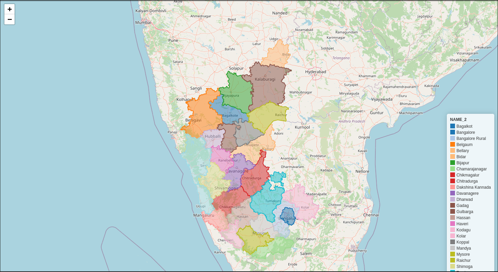

# Geo_Vector Data Analysis

This project focuses on analyzing and visualizing geographical data using GeoPandas. The main objective is to work with shapefiles, specifically analyzing and plotting data for the Karnataka region.

## Project Structure

- **Karnataka_data/Karnataka_dist.shp**: Shapefile containing geographical data for Karnataka.
- **Geo_Vector-data_Analysis.ipynb**: Jupyter notebook with code to analyze and visualize the shapefile data.

## Requirements

To run the code in this project, you will need the following Python libraries:
- `geopandas`
- `matplotlib`
- `folium`
- `mapclassify`

You can install the required libraries using pip:
```bash
pip install geopandas matplotlib folium mapclassify
```

## Usage

1. **Load the Shapefile**:
   The project begins by loading the shapefile containing geographical data for Karnataka.
   ```python
   import geopandas

   shapefile_path = r"Karnataka_data/Karnataka_dist.shp"
   karnataka = geopandas.read_file(shapefile_path)
   ```

2. **Plot the Data**:
   The data is then plotted to visualize the regions within Karnataka.
   ```python
   karnataka.plot("NAME_1", legend=False)
   ```

3. **Explore the Data**:
   The project uses the `explore` function to interactively explore the geographical data.
   ```python
   karnataka.explore("NAME_1", legend=True)
   ```

## Results

The results include various plots and interactive maps showing different regions within Karnataka, allowing for detailed geographical analysis.

- Interactive Map:
  

## Interactive Maps

One of the best ways to create interactive maps is by using libraries like `folium` combined with GeoPandas. This project leverages these tools to provide a rich, interactive experience for exploring geographical data.

## Credits

Special thanks to OpenStreetMap and the open-source community for providing the tools and data that make projects like this possible. This project utilizes data and software from various open-source projects, including:
- [OpenStreetMap](https://www.openstreetmap.org/)
- [GeoPandas](https://geopandas.org/)
- [Folium](https://python-visualization.github.io/folium/)
- [Matplotlib](https://matplotlib.org/)
- [Mapclassify](https://github.com/pysal/mapclassify)

## Conclusion

This project demonstrates how to use GeoPandas for geographical data analysis and visualization, providing insights into the Karnataka region's geographical structure.
